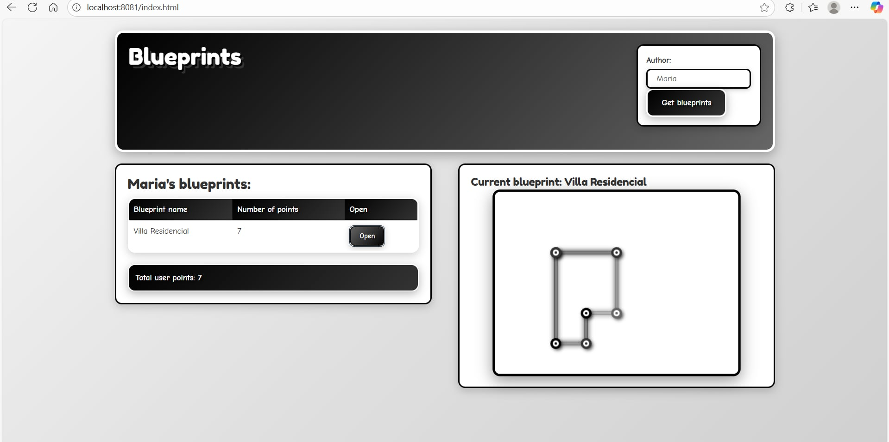
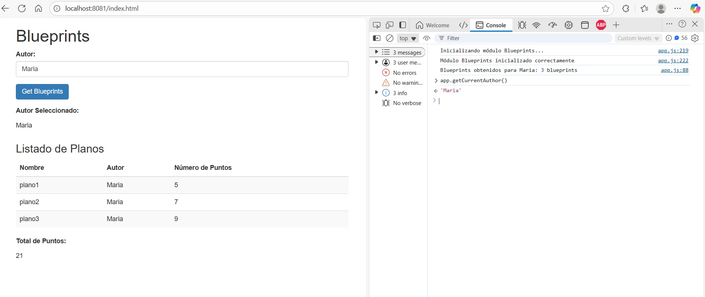
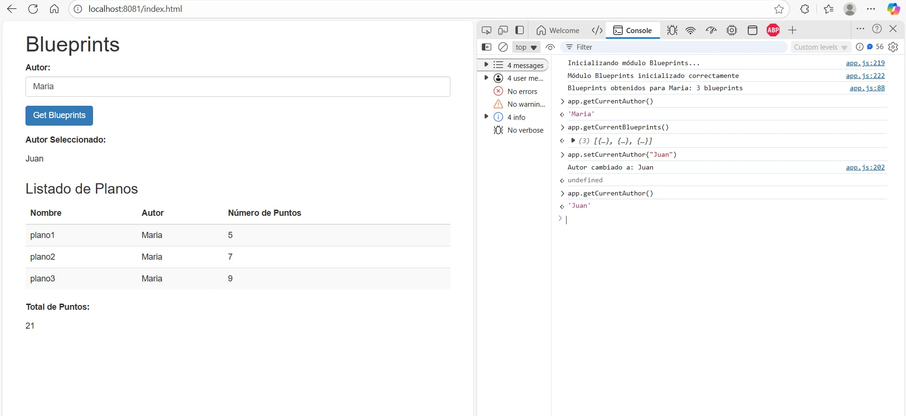
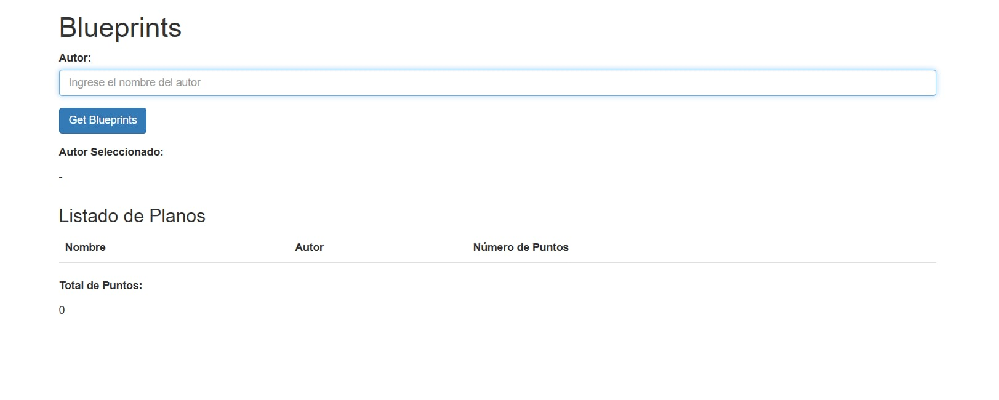
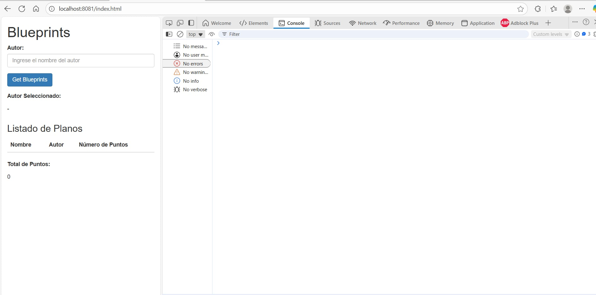
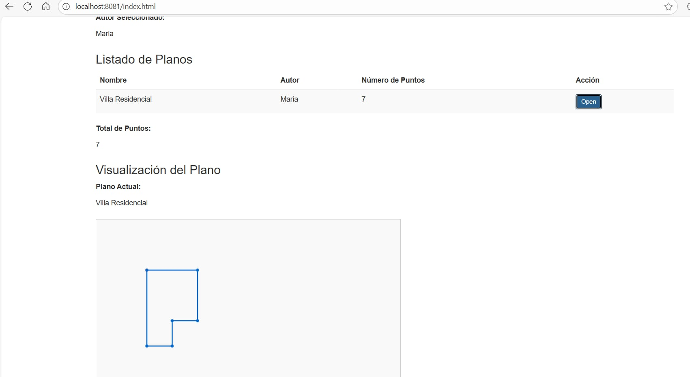

### Escuela Colombiana de Ingeniería

### Arquitecturas de Software
### Autor: Josué Hernández

## Descripción del Proyecto

Este repositorio se enfoca en la implementación del **frontend** del proyecto Blueprints API. Para información detallada sobre el funcionamiento del backend, consulte el repositorio del **Laboratorio 4**.

## Estructura del Proyecto

```
ARSWL-LAB5/
├── README.md                                   
├── ANALISIS_CONCURRENCIA.txt                   
├── pom.xml                                      
├── mvnw, mvnw.cmd                              
├── model.uml                                  
├── Diagrams.asta                               
│
├── img/                                         # Imágenes para documentación
├── src/
│   ├── main/
│   │   ├── java/edu/eci/arsw/
│   │   │   ├── blueprintsapi/
│   │   │   │   └── BlueprintsAPIApplication.java      # Aplicación principal Spring Boot
│   │   │   │
│   │   │   ├── blueprints/controllers/
│   │   │   │   ├── BlueprintAPIController.java        # Controlador REST API
│   │   │   │   └── ResourceNotFoundException.java     # Excepción personalizada
│   │   │   │
│   │   │   ├── config/
│   │   │   │   └── BlueprintsConfiguration.java       # Configuración Spring
│   │   │   │
│   │   │   ├── model/
│   │   │   │   ├── Blueprint.java                     # Modelo de datos Blueprint
│   │   │   │   └── Point.java                         # Modelo de datos Point
│   │   │   │
│   │   │   ├── persistence/
│   │   │   │   ├── BlueprintsPersistence.java         # Interfaz de persistencia
│   │   │   │   ├── BlueprintNotFoundException.java    # Excepción no encontrado
│   │   │   │   ├── BlueprintPersistenceException.java # Excepción persistencia
│   │   │   │   └── impl/
│   │   │   │       ├── InMemoryBlueprintPersistence.java # Implementación en memoria (thread-safe)
│   │   │   │       └── Tuple.java                     # Clase utilitaria para claves compuestas
│   │   │   │
│   │   │   ├── services/
│   │   │   │   └── BlueprintsServices.java            # Capa de servicios/lógica de negocio
│   │   │   │
│   │   │   └── filters/
│   │   │       ├── BlueprintFilter.java               # Interfaz de filtros
│   │   │       └── impl/
│   │   │           ├── RedundancyBlueprintFilter.java  # Filtro eliminación puntos redundantes
│   │   │           └── SubsamplingBlueprintFilter.java # Filtro submuestreo
│   │   │
│   │   └── resources/
│   │       ├── application.properties                 # Configuración de la aplicación
│   │       └── static/                               # Recursos estáticos del frontend
│   │           ├── index.html                        # Página principal del frontend
│   │           ├── js/                               # Módulos JavaScript
│   │           │   ├── app.js                        # Módulo principal con patrón Module
│   │           │   ├── apimock.js                    # Módulo mock para datos de prueba
│   │           │   └── apiclient.js                  # Módulo client para datos reales del API
│   │           └── webjars/                          # Dependencias frontend (jQuery, Bootstrap)
│   │               ├── bootstrap/
│   │               │   └── 3.3.7/
│   │               │       ├── css/
│   │               │       │   └── bootstrap.min.css
│   │               │       └── js/
│   │               │           └── bootstrap.min.js
│   │               └── jquery/
│   │                   └── jquery.min.js
│   │
│   └── test/
│       └── java/edu/eci/arsw/blueprints/test/
│           ├── services/
│           │   └── ApplicationServicesTests.java      # Tests de servicios
│           ├── filters/impl/
│           │   ├── RedundancyBlueprintFilterTest.java  # Tests filtro redundancia
│           │   └── SubsamplingBlueprintFilterTest.java # Tests filtro submuestreo
│           └── persistence/impl/
│               ├── InMemoryPersistenceTest.java       # Tests persistencia
│               └── InMemoryPersistenceDataTest.java   # Tests datos persistencia
│
└── target/                                     # Directorio de compilación Maven (generado)
    ├── classes/                                # Clases compiladas
    ├── test-classes/                           # Tests compilados
    └── ...                                     # Otros artefactos de compilación
```

## Frontend - Interfaz Web

El frontend implementa una interfaz web moderna utilizando:
- **HTML5** para la estructura
- **Bootstrap 3.3.7** para el diseño responsivo
- **jQuery 3.1.0** para la interactividad
- **WebJars** para la gestión de dependencias frontend

### Características del Frontend

- ✅ **Interfaz intuitiva** para consultar blueprints por autor
- ✅ **Tabla dinámica** para mostrar los resultados
- ✅ **Contador de puntos** totales por autor
- ✅ **Módulo JavaScript** con patrón Module para manejo de estado
- ✅ **Comunicación AJAX** con el backend REST API
- ✅ **Canvas HTML5** para visualización y dibujo de planos
- ✅ **Función de dibujo** que dibuja planos específicos en el Canvas
- ✅ **Botones de selección** en cada fila de la tabla para dibujar planos
- ✅ **Módulo API Client** para obtener datos reales del backend REST
- ✅ **Cambio dinámico** entre apimock y apiclient con una sola línea
- ✅ **Diseño mejorado** con Bootstrap siguiendo el mockup del enunciado
- ✅ **Estilo minimalista** con paleta blanco y negro, layout 50/50

### Diseño Final - Estilo Minimalista

La aplicación ha sido transformada con un estilo minimalista y elegante, caracterizado por una paleta de colores exclusivamente blanco y negro:

**🎨 Características Visuales:**
- **Fondo minimalista**: Gradiente gris claro que evoca simplicidad y elegancia
- **Tipografías divertidas**: Fuentes "Fredoka One" y "Comic Neue" para mantener el estilo cartoon
- **Colores minimalistas**: Paleta exclusiva de blanco, negro y grises para un look atemporal
- **Layout 50/50**: Columnas que ocupan exactamente el mismo espacio
- **Efectos sutiles**: Sombras y contornos elegantes en escala de grises

**📐 Estructura del Layout:**
- **Header horizontal**: Título "Blueprints" a la izquierda, entrada de autor a la derecha
- **Columnas equilibradas**: Lista de blueprints (48%) a la izquierda, canvas (48%) a la derecha
- **Espaciado perfecto**: 2% de margen entre columnas para balance visual
- **Responsive**: Se adapta a pantallas móviles manteniendo proporciones

**🎯 Canvas con Estilo Minimalista:**
- **Fondo blanco limpio**: Base neutra para los colores negros y grises
- **Líneas elegantes**: Cada línea con sombra y contorno marcado
- **Puntos con profundidad**: Círculos con sombras exteriores y contornos
- **Colores monocromáticos**: Paleta de 5 tonos de grises bien balanceados
- **Efectos de profundidad**: Sombras y contornos que dan volumen

**🌈 Paleta de Colores Minimalista:**
```css
Colores principales:
- Negro puro: #000 (color principal)
- Gris oscuro: #333 (secundario)
- Gris medio: #666 (terciario)
- Gris claro: #d0d0d0 (fondo)
- Blanco: #fff (contraste)
```

**✨ Efectos Interactivos Minimalistas:**
- **Hover pronunciado**: Escalado de 1.05x al pasar el mouse
- **Transiciones suaves**: Animaciones de 0.3s en todos los elementos
- **Sombras elegantes**: Box-shadows en escala de grises para profundidad
- **Bordes gruesos**: 3-4px para contornos marcados
- **Gradientes monocromáticos**: Colores que se mezclan elegantemente

**🎭 Elementos del Diseño:**
- **Secciones blancas**: Fondo blanco con bordes negros gruesos
- **Botones minimalistas**: Gradientes negro-gris con sombras intensas
- **Tabla contrastante**: Encabezados negros, filas blancas con hover gris
- **Formularios minimalistas**: Bordes negros que cambian a gris al focus
- **Canvas interactivo**: Escalado y sombra intensificada al hover

#### Captura del Diseño Final:

*Interfaz final con paleta blanco y negro, mostrando el layout 50/50 y los elementos minimalistas*

## Módulos JavaScript

### Módulo Principal (app.js)

El archivo `app.js` implementa el **patrón Módulo de JavaScript** para manejar la lógica del frontend:

#### Características del Módulo:
- **Encapsulación**: Variables y funciones privadas para mantener el estado interno
- **API Pública**: Métodos expuestos para interactuar con el módulo
- **Manejo de Estado**: Gestión del autor actual, blueprints y total de puntos
- **Comunicación AJAX**: Integración con el backend REST API
- **Event Listeners**: Manejo de eventos de usuario (clics, teclado)

#### Estructura de Datos Privada:
- **`_currentAuthor`**: Nombre del autor actualmente seleccionado (privado)
- **`_blueprintsList`**: Lista de objetos con estructura `{name: string, points: number}` (privado)
- **`_totalPoints`**: Total de puntos calculado (privado)

#### API Pública Disponible:
- `getCurrentAuthor()` - Obtiene el autor actual
- `getCurrentBlueprints()` - Obtiene la lista de blueprints (nombre y puntos)
- `getTotalPoints()` - Obtiene el total de puntos
- `setCurrentAuthor(newAuthor)` - Cambia el autor actualmente seleccionado
- `updateBlueprintsByAuthor(authorName)` - Actualiza blueprints usando jQuery y operaciones funcionales
- `drawBlueprint(authorName, blueprintName)` - Dibuja un blueprint específico en el canvas
- `switchApi(useApiClient)` - Cambia entre apimock y apiclient dinámicamente
- `getCurrentApi()` - Obtiene el módulo API actualmente en uso
- `clear()` - Limpia todos los datos

#### Funcionalidades Implementadas:
- ✅ **Inicialización automática** cuando el DOM está listo
- ✅ **Validación de entrada** del nombre del autor
- ✅ **Peticiones AJAX** al endpoint `/blueprints/{author}`
- ✅ **Actualización dinámica** de la tabla de resultados
- ✅ **Cálculo automático** del total de puntos
- ✅ **Manejo de errores** con mensajes informativos
- ✅ **Soporte para Enter** en el campo de texto
- ✅ **Estado privado** del autor seleccionado y lista de blueprints
- ✅ **Operación pública** para cambiar el autor actual
- ✅ **Botón de consulta** asociado a la nueva funcionalidad con jQuery

#### Nueva Funcionalidad con jQuery y Operaciones Funcionales:
La función `updateBlueprintsByAuthor()` utiliza:

**Operaciones Funcionales:**
- **Map**: Convierte los blueprints a objetos con `{name, points}`
- **Map**: Genera filas HTML para la tabla usando jQuery
- **Reduce**: Calcula el total de puntos de todos los blueprints

**jQuery DOM Manipulation:**
- `$('#blueprints-tbody').empty()` - Limpia la tabla
- `$('#blueprints-tbody').append()` - Agrega filas dinámicamente
- `$('#total-points').text()` - Actualiza el contador de puntos

**Ejemplo de uso:**
```javascript
// Actualizar blueprints para un autor específico
app.updateBlueprintsByAuthor("maria");

// Verificar los resultados
console.log(app.getCurrentBlueprints());
console.log(app.getTotalPoints());
```

### Módulo API Mock (apimock.js)

El archivo `apimock.js` proporciona datos de prueba para simular el backend:

#### Características del Módulo Mock:
- **Datos de prueba** para 5 autores diferentes
- **Método `getBlueprintsByNameAndAuthor`** para obtener planos específicos
- **Múltiples blueprints** por autor con diferentes cantidades de puntos
- **Simulación de delay** de red (500ms)
- **Manejo de errores** para autores inexistentes
- **API consistente** con el backend real

#### Autores Disponibles para Pruebas:
- **maria**: 3 blueprints (5, 7, 9 puntos respectivamente) = **21 puntos total**
- **juan**: 4 blueprints (6, 10, 5, 11 puntos respectivamente) = **32 puntos total**
- **pedro**: 2 blueprints (12, 5 puntos respectivamente) = **17 puntos total**
- **ana**: 3 blueprints (15, 5, 7 puntos respectivamente) = **27 puntos total**
- **carlos**: 1 blueprint (17 puntos) = **17 puntos total**

#### Funcionalidades del Mock:
- ✅ **Simulación de peticiones AJAX** con callback
- ✅ **Manejo de errores 404** para autores inexistentes
- ✅ **Delay realista** de red
- ✅ **Datos consistentes** y predecibles para pruebas

### Módulo API Client (apiclient.js)

El archivo `apiclient.js` proporciona acceso a datos reales del backend REST:

#### Características del Módulo API Client:
- **Peticiones HTTP reales** usando jQuery AJAX
- **Mismas operaciones** que apimock pero con datos del servidor
- **Manejo de callbacks** para operaciones asíncronas
- **Manejo de errores** HTTP con códigos de estado
- **URLs base** configuradas para el endpoint `/blueprints`

#### Operaciones Disponibles:
- **`getBlueprintsByAuthor(author, callback)`**: Obtiene blueprints por autor
- **`getBlueprintsByNameAndAuthor(author, blueprintName, callback)`**: Obtiene blueprint específico
- **`getAuthors(callback)`**: Obtiene lista de autores disponibles
- **`getBlueprintCount(author, callback)`**: Obtiene cantidad de blueprints por autor
- **`getTotalPoints(author, callback)`**: Obtiene total de puntos por autor
- **`getAllBlueprints(callback)`**: Obtiene todos los blueprints

#### Endpoints REST Utilizados:
- **GET `/blueprints`**: Obtener todos los blueprints
- **GET `/blueprints/{author}`**: Obtener blueprints por autor
- **GET `/blueprints/{author}/{bpname}`**: Obtener blueprint específico
- **GET `/blueprints/authors`**: Obtener lista de autores

#### Manejo de Errores:
- **404**: Autor o blueprint no encontrado
- **500**: Error interno del servidor
- **Network errors**: Errores de conectividad
- **Callback pattern**: `callback(error, data)` donde error es null en caso de éxito

#### Cambio Dinámico entre Módulos API:
La aplicación permite cambiar entre `apimock` y `apiclient` con solo una línea de código:

**Método 1: Modificar la configuración en el código**
```javascript
// En app.js, línea 10, cambiar:
var _useApiClient = true;  // true = apiclient, false = apimock
```

**Método 2: Usar las funciones públicas**
```javascript
// Cambiar a apimock (datos de prueba)
app.switchApi(false);

// Cambiar a apiclient (datos reales)
app.switchApi(true);

// Verificar el módulo actual
console.log('API actual:', app.getCurrentApi());
```

**Ventajas del Sistema de Cambio Dinámico:**
- **Una sola línea**: Cambio con solo modificar `_useApiClient`
- **Referencia dinámica**: `_api` apunta automáticamente al módulo correcto
- **Sin duplicación**: Todas las llamadas usan la misma referencia
- **Funciones públicas**: Cambio dinámico en tiempo de ejecución
- **Logging automático**: Muestra qué API está en uso al inicializar

#### Ventajas del API Client:
- **Datos reales**: Obtiene información actual del servidor
- **Sincronización**: Los datos siempre están actualizados
- **Escalabilidad**: Puede manejar grandes cantidades de datos
- **Persistencia**: Los datos se mantienen entre sesiones

## Funcionalidad de Dibujo de Planos

### Canvas HTML5
Se ha implementado un Canvas HTML5 para la visualización y dibujo de planos:

**Características del Canvas:**
- **ID**: `blueprint-canvas` para fácil identificación
- **Dimensiones**: 400x300 píxeles (equilibrio entre espacio y funcionalidad)
- **Estilo**: Borde negro y fondo blanco para mejor visibilidad

**Funcionalidad de Dibujo:**
- **Función**: `app.drawBlueprint(authorName, blueprintName)`
- **Integración**: Usa `apimock.getBlueprintsByNameAndAuthor()` con callback
- **Dibujo**: Conecta puntos consecutivamente con segmentos de línea
- **Visualización**: Actualiza el campo "Plano Actual" con jQuery

### Botones de Selección en la Tabla
Se han agregado botones "Open" en cada fila de la tabla de blueprints:

**Nueva Columna "Acción":**
- **Ubicación**: Última columna de la tabla de blueprints
- **Contenido**: Botón "Open" para cada fila
- **Estilo**: Botón Bootstrap pequeño (`btn btn-primary btn-sm`)

**Funcionalidad de los Botones:**
- **Event Listeners**: Configurados dinámicamente con jQuery
- **Parámetros**: Cada botón contiene `data-author` y `data-blueprint`
- **Acción**: Al hacer clic, llama a `app.drawBlueprint(author, blueprint)`
- **Validación**: Verifica que los datos estén disponibles antes de dibujar

**Flujo de Trabajo Completo:**
1. Usuario ingresa nombre del autor
2. Usuario hace clic en "Get Blueprints" o presiona Enter
3. Se muestra la tabla con todos los blueprints del autor
4. Cada fila incluye un botón "Open"
5. Usuario hace clic en "Open" para cualquier blueprint
6. Se dibuja el plano seleccionado en el Canvas
7. Se actualiza el campo "Plano Actual" con el nombre

## Capturas de Pantalla

**Funcionalidad de Cambio de Autor:**


**Nuevo Autor Seleccionado:**


**Interfaz Principal:**


**Consola del Navegador (Sin Errores):**


**Ejemplo Visual del Canvas:**


**Ejemplo Visual del API Client en Funcionamiento:**


## Cómo Ejecutar el Frontend

### Prerrequisitos
- Java 17 o superior
- Maven 3.6 o superior

### Pasos para Ejecutar

1. **Ejecutar la aplicación:**
   ```bash
   mvn spring-boot:run
   ```

2. **Acceder al frontend:**
   - Abrir el navegador en: `http://localhost:8081/index.html`
   - La aplicación se ejecuta en el puerto 8081

### Verificación de Funcionamiento

Para verificar que el frontend funciona correctamente:
1.  **Probar la funcionalidad:**
   - Ingresar un nombre de autor en el campo de texto (ej: "maria", "juan", "pedro", "ana", "carlos")
   - Hacer clic en "Get Blueprints"
   - Verificar que la interfaz responde correctamente
   - Probar con un autor inexistente (ej: "autor_inexistente") para verificar manejo de errores

### Tecnologías Utilizadas

- **Spring Boot 2.7.18** - Framework backend
- **WebJars** - Gestión de dependencias frontend
- **Bootstrap 3.3.7** - Framework CSS
- **jQuery 3.1.0** - Biblioteca JavaScript
- **HTML5** - Estructura de la página